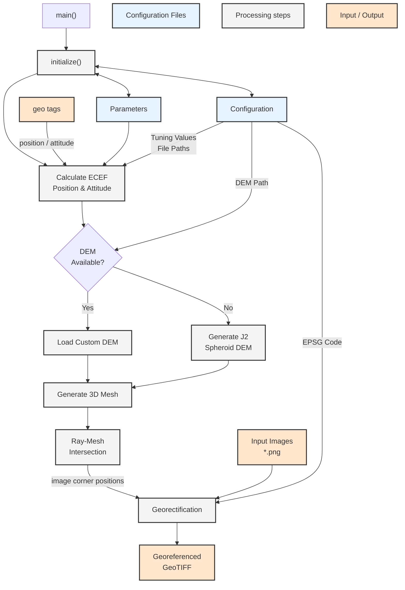

<style>
r { color: Red }
o { color: Orange }
g { color: Green }
b { color: blue}
</style>

#  Mugin Georeferencing Pipeline

A Python package for processing geospatial reference data.


## Installation

### Automated Installation (Windows)

1. Clone the repository
2. Run `setup_windows.bat`

#### Linux/Mac
1. Clone the repository
2. Make the script executable: `chmod +x setup_linux.sh`
3. Run `./setup_environment.sh`

### Manual Installation using Conda (Recommended)

1. Create and activate conda environment (in miniconda3 or similar)
```
conda nv create -f environment.yml
conda activate georef_env
```
2. Install the package
```pip install .```

## Get a Digital Elevation Model (DEM)
The georeferencing pipeline needs  a DEM (or DTM / DOM) to georeference the images to. If no DEM is provided a default DEM (Earth Oblated Spheroid) is used.
The following describes how to get a custom DEM. This is only one possible method go get a DEM for the selected area, other methods to get a custom DEMs do exist also.
1. Find relevant elevation models  (e.g. on [Geonorge](https://www.geonorge.no/kartdata/datasett-i-geonorge/basis-geodata/), resp. [Kartverket høydedata](https://hoydedata.no/LaserInnsyn2/) or similar) and download them (normally *.geotiff files)
2. Load into these geotiff files into QGIS
3. Merge all elevation models into one raster-layer

  In QGIS:
  - Raster -> Miscallenious
  - Merge (Select all rasters to be merged) -> Run
5. Clip raster to the area needed
  In QGIS:
    - Raster 
    - Extract
    - Clip raster by Extent
    - Select layer (assign a no-data value (e.g. -9999.0), save to file, clipping extent)
    - Run
6. Export raster to file as *.geotiff
7. Copy the *.geotiff DEM file into "\DATA\DigElev\<DEM_name.tif>"
8. Update the path with the DEM name in the [config.ini](\CONFIG\config.ini)

## Folder Structure
```bash
├── src
│   ├── objects
│   │   ├── <python object files>
│   ├── tools
│   │   ├── <helper function files>
│   ├── __init__.py
|   ├── main.py
├── CONFIG
│   ├── config.ini
│   ├── parameters.xml
├── DATA
│   ├── DigElev
│   ├── ├── Digital_elevation_model.tif
│   ├── ├── model_temp (autogenerated)
│   ├── ├── model.ply (autogenerated)
│   ├── input
│   ├── output
├── enviroment.yml
├── README.md
├── requirements.txt
├── setup_linux.sh
├── setup_windows.sh
├── setup.py
└── .gitignore
```

## Georeference images, workflow
Georeferencing Mugin images with this pipeline shall be done as follows:
> **Note:** Before starting the georeferencing process make sure a DEM is loaded in "\DATA\DigElev\<DEM_name.tif>" and the name is updated in the [config.ini](\CONFIG\config.ini) file
1. Load images into the input folder specified in the [config.ini](\CONFIG\config.ini) file (normally: "\DATA\input\")
2. Load the gpslog file into the same input folder as the images. The filename must start with "gpslog...".
3. Make sure the output folder is specified correctly in the [config.ini](\CONFIG\config.ini) file (normally "\DATA\input\")
4. Check all the other settings in  the [config.ini](\CONFIG\config.ini) file (see below):
5. run "/src/main.py"

## Configuration file

Part of the configuration file is autogenerated:
    - <g>change to appropriate value</g>
    - <r>don't change (autogenerated)</r>

|Config file parameter     |Value                           |Description                  |
|------------------|----------------------------|-----------------------------|
|<g>missionname</g> |`'string'`    |Title for the project            |
|<g>inputfolder</g>   |`'path'`      |older containing all the images in *.png or *.jpg format and the gpslog.txt file |
|<g>outputfolder</g>  |`'path'`|Georeferenced geotiff files are saved in this folder|
|<g>sensor</g>            |`'sensor name'`|Which imaging sensor was used the drone (This is used to read the relevant parameters from [parameters.xml](\CONFIG\parameters.xml). <br> Sensor names (`'sensor name'`) are: <ul><li>P1 35mm</li><li>H20T Thermal</li><li>H20T Zoom 2x</li><li>Sony ILX-LR1</li></ul>|
|<g>output_epsg</g>      |`'epsg-code'` |The EPSG code for the Universal Transverse Mercator (UTM) onto which the images shall be georeferenced, see [here](https://epsg.io/) for more details (e.g. 32623 for WGS-84 / UTM zone 32N)|
|<g>overwrite_output</g>|`'boolean'` |If `'True'`, files in the output folder will be overwritten automatically (`'True'` or `'False'`)|
|<g>downscale_factor_imgs</g>|`'int'`|Factor (> 1) by which the output images shall be downscalled (1 or -1 for no downscalling)|
|<g>mirror_images</g>|`'string'`|Mirror georeferenced images: <br> 3 options: <ul><li>no mirroring = `'none'`</li><li>mirror images horizontally = `'horizontal'`</li><li>mirror images vertically = `'vertical'`</li><li>mirror images vertically and horizontally = `'both'`</li></ul>|
|<g>wgs84_altitude_at_takeoff</g>|'float'|Altitude of the WGS-84 ellipsoid at the takeoff point [m]|
|<g>delta_north</g>|`'float'`|Tuning parameter, move output images north [m]|
|<g>delta_east</g>|`'float'`|Tuning parameter, move output images east [m]|
|<g>rotation</g>|`'float'`|Tuning parameter, rotate output images clockwise [°]|
|<g>delta_flight_dir</g>|`'float'`|Tuning parameter, move images in flight direction [m]|
|<g>delta_perpend_flight_dir</g>|`'float'`|Tuning parameter, move images perpendicular to the flight direction (positive = 'right') [m]|
|<g>delta_altitude</g>|`'float'`|Tuning parameter, move UAV in altitude (this will shrink / enlarge the images) [m]|
|<g>pitch_angle</g>|`'float'`|Tuning parameter, pitch rotation of the camera due to mounting of the camera in the UAV and due to trimmed flight conditions of the UAV [°]|
|<g>roll_angle</g>|`'float'`|Tuning parameter, roll rotation of the camera due to mounting of the camera in the UAV and due to trimmed flight conditions of the UAV [°]|
|<g>yaw_angle</g>|`'float'`|Tuning parameter, yaw rotation of the camera due to mounting of the camera in the UAV and due to trimmed flight conditions of the UAV [°]|
|<g>dem_path</g>|`'path'`|Path to the DEM geotiff file|
|<r>model_path</r>|`'path'`|Path to the DEM model (autogenerated)|
|<g>subsample_factor</g>|`'int'`|subsample factor for the DEM (choose a large no. (e.g. 1000) for smooth surfaces like ocean, and a smaller number for more rugged surfaces.|
|<r>epsg_wgs84</r>|`'int'`|EPSG code (autogenerated, do not change!!!)|
|<r>dem_epsg</r>|`'int'`|EPSG code of the DEM (autogenerated, do not change!!!)|


## Processing flow


